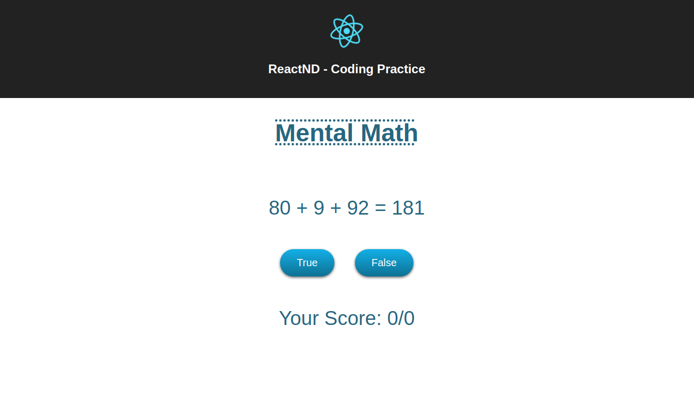
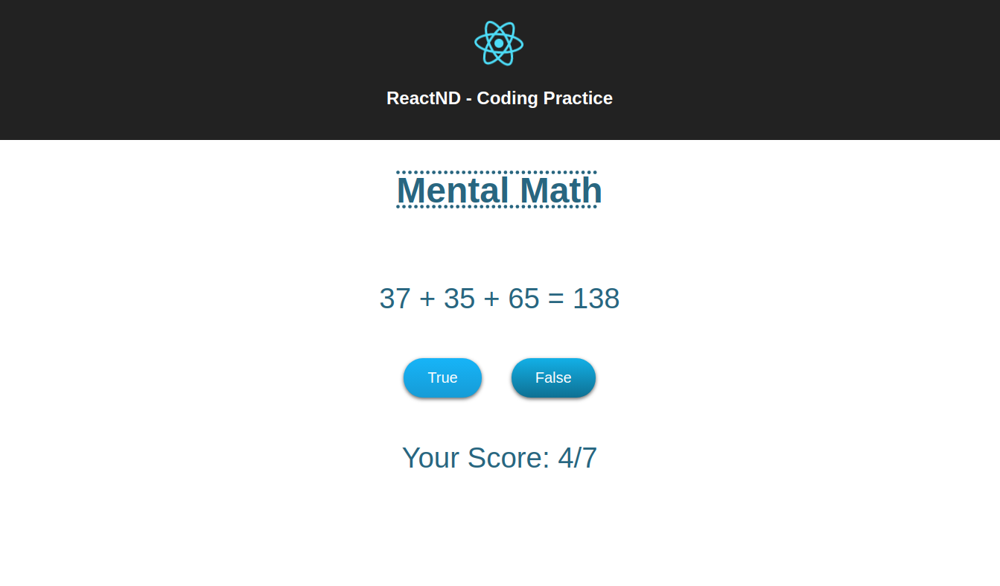

# Number Game

Number Game is a project made by me in the Udacity Nanodegree React Course.





## Installation

Clone the project repository:

```bash
git clone https://github.com/mat-alcantara/number-game-react.git
```

Go to the project's folder

```bash
cd number-game-react
```

Use the package manager [npm](https://www.npmjs.com/) to install Number Game.

```bash
npm install
```

## Usage

You only need to execute the following command inside the project's folder

```bash
npm start
```

## License

[MIT](https://choosealicense.com/licenses/mit/)
